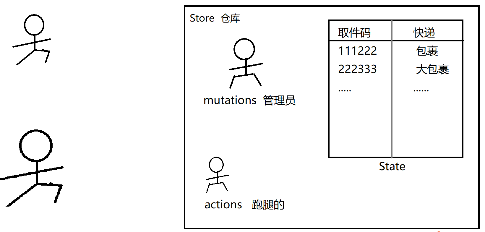

# TSOOP DAY01

### Vuex   Vue官方推荐的全局状态管理器

在脚手架项目的实现过程中，避免不了需要将一些数据存入“全局共享区域”，方便在任何组件中直接获取并且使用。这种需求就非常契合`vuex`的功能。`vuex`主要用于实现将一些数据全局存储，需要使用的使用直接访问`vuex`即可获取这些数据。

https://v3.vuex.vuejs.org/zh/guide/state.html



#### Vuex的核心概念

```javascript
new Vuex.Store({
  state: {    },
  getters: {   },
  mutations: {   },
  actions: {    },
  modules: {    }
})
```

1. **state：单一状态树。用于存储全局共享的数据信息。**

   ```javascript
   state: {
       cityname: '北京',
       user: {
           username: 'admin',
           nickname: '管理员·亮'
       }
   }
   ```

   在组件中，使用如下代码即可访问vuex中state里定义的状态数据：

   ```javascript
   this.$store.state.cityname
   this.$store.state.user.nickname
   ```

2. **mutations: 用于声明一些修改state数据的方法**

   ```javascript
   mutations: {   
       updateUser(state, payload){  
           state.user = payload
       }
   },
   ```

   需要修改user时，可以通知vuex，执行updateUser方法，更新用户信息：

   ```javascript
   this.$store.commit('updateUser', user)
   ```

3. **actions：用于定义一些方法，执行异步任务后得到结果，让后更新state。（这次更新state，需要调用mutations中声明的方法更新state，而不是直接更新）。**

   ```javascript
   actions: {
       login(store, payload){
           // 此处 发登录请求  payload就是传来的账号与密码
           // 得到登录结果后，将user对象，更新state.user
           store.commit('updateUser', user对象)
       }
   }
   ```

   如下代码，即可通知vuex执行actions：

   ```javascript
   this.$store.dispatch('login', {username:'admin', password:'123456'})
   ```


Vuex为了更加方便的访问state、调用mutations、actions方法，提供了**“vuex辅助函数”**的API。

**使用mapState方便的访问State数据：**

```javascript
import { mapState } from 'vuex'

export default {
  // 计算属性
  computed: {
    ...mapState(['user', 'cityname']),
  }
};
```

如下代码，即可访问到state中的数据：

```html
{{user.nickname}}
{{cityname}}
```


使用mapMutations, mapActions辅助函数，方便的访问mutations/actions方法：

```javascript
import { mapMutations, mapActions } from 'vuex'

export default {
  // 函数
  methods: {
    ...mapMutations(['updateUser']),
    ...mapActions(['login']),
  }
};
```

如果希望调用mutations中定义的updateUser时，就可以如下调用：

```
this.updateUser(user对象)
this.login({username:'1', password:'123'})
```


虽然vuex可以实现SPA项目的状态数据的统一管理，但是不能刷新页面。一旦刷新了页面，就会重新加载vue容器，就会初始化vuex中的数据。

这时就需要实现将vuex中的数据进行 **持久化存储（刷新不消失）**。需要借助于html5提供的localStorage、sessionStorage来解决问题。实现思路如下：

1. 当向vuex中存储数据时，顺带向storage中也存一份。
2. 当刷新后，vuex的数据将会初始化，那么可以直接给vuex中定义的变量初始化为storage中读取出来的数据。

**为什么不直接用Storage存储数据呢？Storage中的数据存储在磁盘中，并不能实现数据更新时的响应式效果（数据变化会同步到页面显示）。vuex中的数据 是可以与UI同步的。所以一般情况下二者结合起来使用。**


封装一些简单的API来处理Storage的数据存储与数据加载。

```javascript
// utils/Storage.js
// 在该文件中，管理数据的存储与加载  （使用SessionStorage）
const storage = {
  // 定义一些常见的KEY，后续如果需要保存与加载时可以直接使用
  KEY_USER: 'user',  
  KEY_TOKEN: 'token',
  KEY_CITY: 'city',

  /** 保存[key, value]到sessionStorage */
  set(key, value){
    sessionStorage.setItem(key, JSON.stringify(value))
  },

  /** 通过key获取对应的value */
  get(key){
    let str = sessionStorage.getItem(key)
    if(str){
      return JSON.parse(str)
    }
    return null
  }
}

export default storage;
```


**发现了一个问题，不登录也可以对数据进行增删改查。** 实际上，应该实现如下业务场景：

1. 只有在登录之后，才可以看到登录之外的页面。
2. 只有在登录之后，才可以发送其他的http增删改查的请求，否则就算发送了请求，也应该被服务端驳回：不登录没有操作数据的权限。


#### 只有在登录之后，才可以看到登录之外的页面

**实现思路：**在项目的VueRouter对象中添加路由的**全局前置守卫**。前置守卫将会在跳转到目标路由页面之前先执行，那么可以在此处进行判断，如果用户没有登录（vuex里没有user），则直接跳转到登录页面。如果用户登录了就通过验证，可以看到后续页面。

#### 完整的导航解析流程

1. 导航被触发。
2. 在失活的组件里调用 `beforeRouteLeave` 守卫。
3. 调用全局的 `beforeEach` 守卫。
4. 在重用的组件里调用 `beforeRouteUpdate` 守卫 (2.2+)。
5. 在路由配置里调用 `beforeEnter`。
6. 解析异步路由组件。
7. 在被激活的组件里调用 `beforeRouteEnter`。
8. 调用全局的 `beforeResolve` 守卫 (2.5+)。
9. 导航被确认。
10. 调用全局的 `afterEach` 钩子。
11. 触发 DOM 更新。
12. 调用 `beforeRouteEnter` 守卫中传给 `next` 的回调函数，创建好的组件实例会作为回调函数的参数传入。


#### 只有在登录之后，才可以发送其他的http增删改查的请求，否则就算发送了请求，也应该被服务端驳回：不登录没有操作数据的权限

如果想要实现该功能，则需要服务端进行用户验证，验证当前的请求中是否包含登录用户身份（服务端需要完成用户的**鉴权**）。如果该用户有访问该接口资源的权限，则执行相应业务；如果该用户没有处理该请求资源的权限，则指直接打回去，返回错误响应消息：您没有操作该模块的权限。


#### HTTP状态管理

网络通信过程中的长连接模式、短连接模式

短连接模式的通讯方式：客户端与服务端建立连接，建立成功后，进行交互，交互完毕后连接断开。这种模式将会极大的释放服务端资源给更多的客户端使用。但是也有一个弊端：由于每一个请求都是**独立的请求**，所以服务端是无法将同一个客户端发送的多次请求当成一个整理来看待的。所以，我们也称http协议为**无状态的协议**。 

Cookie   Session   

#### 基于Token机制实现上述鉴权请求   JsonWebToken（JWT）

1. 当登录成功后，从服务端获取登录成功后返回的结果，其中包含：登录成功的用户以及token字符串。将这些信息保存在客户端供以后使用。
2. 以后同一个客户端发送后续请求时，都需要携带该token字符串一起发送请求，这样服务端才知道该客户端的登录账号是谁（因为这个加密的token字符串中包含这些信息， 服务端可以对该字符串进行解密，获取token中保存的信息，完成相关业务）。

客户端发送请求时，需要携带Authorization消息头，传递token字符串（在登录成功后保存下来）。


#### 更加细化的后台管理项目中的权限系统

对于后台管理网站的用户体力来讲，不同的账号将会分配不同的**角色**，例如：

```
系统管理员      admin	123456
电影数据管理员	  liang    123456
影院数据管理员   xin      123456
```

不同的账号登录时，应该具备以下功能：

1. 不同的账号看到的左侧边栏的菜单不同。
2. 相应的账号可以处理相应模块的请求，如果访问了其他模块的请求，服务端应该返回此账号无权限访问该功能。


##### 不同的账号看到的左侧边栏的菜单不同

当登录成功后，客户端将得到绑定了用户信息的token字符串。

进而在首页立即发送请求：**找服务端要动态的侧边栏列表**，服务端根据token判断用户的角色，获取用户可以访问的菜单列表，整理成json返回客户端：

```json
[
    {
        index: '/home/index',
        icon: '图标',
        name: '首页'
    },
    {
        index: '1',
        icon: '图标',
        name: '演员管理',
        children: [
            {
                index: '/home/actor-list',
                icon: '图标',
                name: '演员列表',
            }
            ....
        ]
    },
]
```

用户表

角色表

权限表

所以理论上来讲，一个**电影数据管理员**应该是看不到**新增演员**的。 

但是却不能阻挡这个**电影数据管理员**直接在浏览器中输入地址，来访问新增演员的页面。

```
http://localhost:8080/home/actor-add
```

这种不合法的操作可以想一些办法来解决，一般有以下两种办法：

1. 让**电影数据管理员**可以看到新增演员的静态页面，但是当发请求时，因为服务单验证了账号权限，所以请求驳回，请求失败。

2. 当**电影数据管理员**访问新增演员地址时，直接返回404页面。（**异步注册路由**） 

   不同的账号，应该注册不同的路由数组。

   在router/index.js中配置的所有路由对象大致分为两部分：

   1. 静态路由（所有用户都可以跳转过去的地址）

      ```
      /home/index
      /user/login
      /404
      /500
      ```

   2. 动态路由（从服务端加载数据，在客户端整理，生成路由列表，动态设置）

      ```
      /home/actor-add
      /home/movie-list
      ......
      ```


##### 按钮级别的权限管理

不同的账号需要根据权限或角色来控制是否显示页面中的某些特殊按钮（删除）

```html
<el-button v-if="user.role=='admin'">删除电影</el-button>
```

经典的做法：可以自定义一个指令，来判断当前组件是否应该显示：

```html
<el-button v-check-permission="del-movie">删除电影</el-button>
```


### VueCLI项目的上线流程

前后端分离项目需要上线的项目有两个：

1. nodejs+mysql+express写的后端项目，提供后台接口。

   访问：`https://web.codeboy.com/bmdapi/xxx` 就可以访问后台接口。  

2. VueCLI、Vue2、ElementUI、Axios等写的前端项目，提供静态页面。

   访问：`https://web.codeboy.cn/home/index` 就可以看到首页。该页面将自动通过axios向`https://web.codeboy.com/bmdapi/xxx`发请求访问接口，从而完成相关功能。

上线一个完整项目所需要在服务端安装的软件：

```
mysql   pm2   nodejs   
nginx
```

#### 大致步骤

1. **将后端项目上线并测试通过。**
   1. 安装mysql。
   2. 初始化sql脚本。
   3. 将后端程序上传到服务器，配置好数据库访问参数，通过pm2启动服务即可。
2. **将前端项目编译打包上线并完成联调。** 
   1. 将VueCLI项目进行打包编译。输出为dist静态资源包。
   2. 下载安装nginx软件，启动nginx服务，代理dist目录作为网站根目录。
   3. 域名管理。


#### 将前端项目编译打包上线并完成联调

1. 将VueCLI项目进行打包编译。输出为dist静态资源包。

   进入vueCLI项目根目录，执行命令：

   ```shell
   npm  run  build
   ```

   命令执行完毕后，将会在当前目录下生成dist文件夹。


