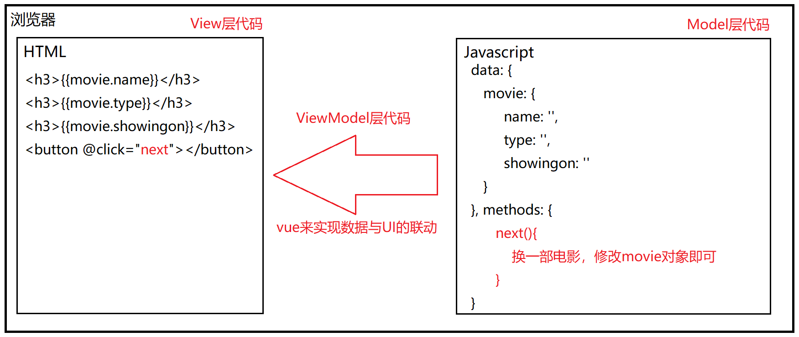
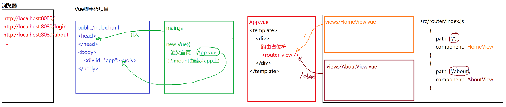
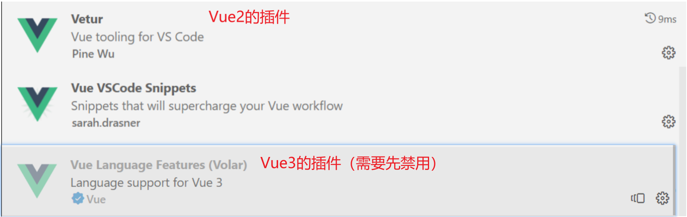

# Vue DAY02

### MVVM架构

M - Model层    业务逻辑层     主要用于管理数据，实现业务

V - View层     视图层                主要用于将数据显示在页面上

VM -  ViewModel层   视图模型层          主要用于业务逻辑与视图的联动 （Vue来做）




### 基于脚手架环境开发vue项目

开发vue项目有两种模式：

1. 基于vue.js，在html页面中引入vue.js， 让vue.js管理div#app元素。
2. 基于脚手架环境：通过vue脚手架环境可以方便的创建一个通用的vue项目框架模板，在此基础之上开发vue项目更加快捷，适合工程化开发。


#### VueCLI脚手架开发环境

https://cli.vuejs.org/

##### 安装脚手架 

```shell
# 设置npm源地址  
npm set registry https://registry.npmmirror.com

# 安装脚手架
npm install -g @vue/cli
```

**安装配置VueCLI，通过VueCLI创建项目的过程，详情查看：**

```
ftp目录/VueBasic/day02/resource/VueCLI_installation_guide.pdf
```

找一个干净地方，新建项目包：

```shell
# day02/demo/
vue  create   vue-project
```

一旦项目创建完毕后，即可通过命令，启动脚手架项目（端口为8080的服务），提供网站的访问。

```shell
npm run serve
```

打开浏览器：`http://localhost:8080/`


该项目的node_modules目录是不会上传远程仓库的，所以从仓库下载的项目包是很小的，如果需要运行，则应该在package.json所在目录执行命令，安装所需要的依赖模块：

```shell
npm install
```


脚手架运行时涉及到的文件：

> public/index.html
>
> src/main.js
>
> src/App.vue
>
> src/views/HomeView.vue (先放下)
>
> src/views/AboutView.vue (先放下)

**脚手架的运行过程：** 当执行`npm run serve`时，将会编译整个项目。启动8080服务来提供网站的访问。当访问地址：`http://localhost:8080`时，将会看到`public/index.html`，并且在该页面中将自动加载`main.js`中的代码，创建vue对象，由该vue对象来管理页面中的`#app`。

```javascript
new Vue({
  router,
  store,
  render: h => h(App)
}).$mount('#app')
```

初始化的状态下， 默认将会把App.vue组件（`Component`）中的内容渲染到#app中，从而看到页面效果。


**需求：设计一个页面，使用脚手架实现。**

访问：http://localhost:8080/login，可以看到一个登录页面：包含账号、密码、登录按钮。


### 脚手架路由系统（VueRouter）的设计与使用

脚手架的路由系统的功能是通过浏览器地址栏的地址来动态显示页面内容。

> 当访问：/login时，可以看到Login页面。
>
> 当访问：/时，可以看到HomeView页面。
>
> 当访问：/about时，可以看到AboutView页面。
>
> ......



在路由系统中有个非常重要的组件：`<router-view/>`，它可以根据请求路径的不同，动态的在该位置显示相应组件内容。具体如何显示得参照 `src/router/index.js`的配置：

```javascript
const routes = [
  {
    path: '/',
    name: 'home',
    component: HomeView
  },
  {
    path: '/about',
    name: 'about',
    component: () => import('../views/AboutView.vue')
  }
]
```

思考题：尝试实现刚才的登录页面的需求。

访问：http://localhost:8080/login，可以看到一个登录页面：包含账号、密码、登录按钮。

1. 先创建一个组件：views/Login.vue，在template中定义页面内容。
2. 配置router/index.js配置文件，使得访问：/login时可以看到Login.vue。
3. 访问地址，测试效果。


推荐大家安装vscode插件（Vetur），用于在vue文件中代码提示等功能。




案例：

访问：http://localhost:8080/movie-detail，可以看到一个电影详情页面（MovieDetail.vue）

用于显示电影基本信息。

访问：http://localhost:8080/movie-list，可以看到一个电影列表页面（MovieList.vue）

用于显示电影列表数据。


#### `xxx.vue`文件的语法

每一个.vue文件都是一个vue组件，一个组件封装了页面中的局部内容（包括页面结构、元素的样式、事件功能）。一个完整的网页是由很多组件共同完成。所以就需要了解一下.vue文件的语法，来搞定项目页面的功能实现细节。

```html
<template>
  <div></div>
</template>

<script>
  export default {   }
</script>

<style lang="scss" scoped>

</style>
```

`template`部分用于定义当前组件的页面结构。定义的这些页面结构都会被显示在#app上。注意：**template中的内容有且仅有一个根元素**。   

`script`部分用于定义当前组件的`js`脚本。 

在script中可以通过`data(){}`来提供当前组件所需要使用的数据。也可以通过`methods:{}`来提供当前组件所需要使用方法。

`style`部分用于定义当前组件中标签的css样式。

在style标签上可以添加scoped属性，一旦style标签上有scoped属性，则在此style段中定义的样式只针对当前组件生效（原理就是当前组件的每一个元素都会生成一个随机属性，使用属性选择器来代替普通选择器）。如果没有scoped属性，则样式一旦被加载后将全局生效。

SPA（Single Page Application）项目

### Vue的常用指令

> 1. v-on 绑定事件。
> 2. v-bind  动态绑定属性。
> 3. v-show  
> 4. v-if
> 5. v-text     类似{{}}，显示文本
> 6. v-html    可以将文本当做html解析显示
> 7. v-pre     原样显示，不解析双花括号
> 8. v-for     
> 9. v-* 等


#### v-for指令的用法

v-for指令用于循环输出重复的元素。例如：

```html
<p v-for="item in names">{{item}}</p>
```

```javascript
data(){
    return {
        names: ['杀手', '功夫', '功夫熊猫', '灌篮高手']
    }
}
```

上述代码将会输出4个p标签，并且每个p标签中将显示相应的数组元素。最终输出：

```html
<p>杀手</p>
<p>功夫</p>
<p>功夫熊猫</p>
<p>灌篮高手</p>
```

案例：写一个组件：views/For.vue， 当访问：/for时，可以看到它。测试v-for指令。


**基于v-for遍历对象数组**

```html
<h3>遍历电影对象数组</h3>
<p v-for="item in movies" :key="item">
    ID：{{item.id}} &nbsp;&nbsp;|&nbsp;&nbsp;
    名称：《{{item.name}}》 &nbsp;&nbsp;|&nbsp;&nbsp;
    {{item.duration}}分钟  &nbsp;&nbsp;|&nbsp;&nbsp;
    {{item.showingon}}上映 
</p>
```

```javascript
movies: [
    {id:1, name:'杀手', duration:114, showingon: '05-02'},
    {id:2, name:'功夫', duration:124, showingon: '06-06'},
    {id:3, name:'功夫熊猫', duration:125, showingon: '08-22'},
    {id:4, name:'灌篮高手', duration:143, showingon: '01-12'}
]
```

#### `:key`的作用

`v-for`指令一般都需要配一个 `v-bind:key` `(:key)` 来为当前每一个列表项设置一个唯一标识符（简单理解为一个名字），目的是为了提高列表更新时的DOM渲染性能。


------

作业：建10个项目


