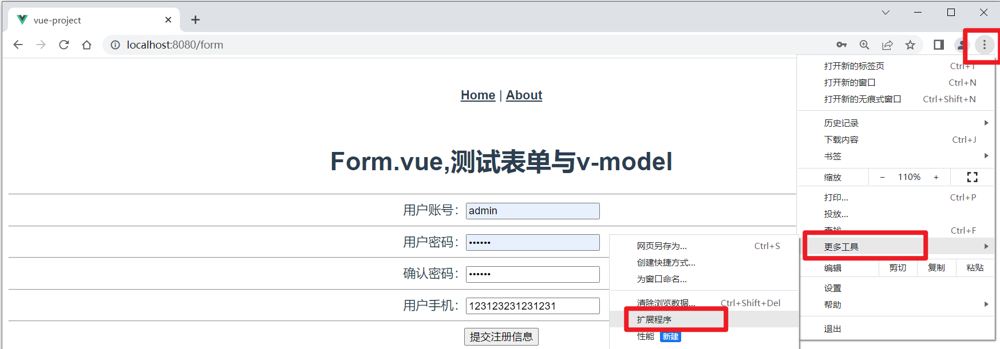
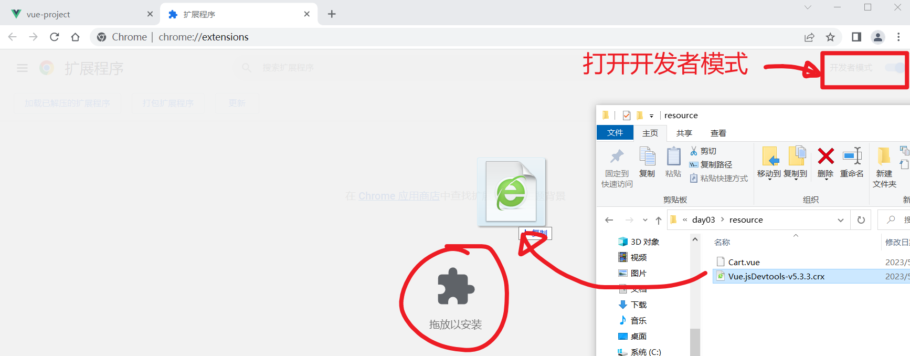
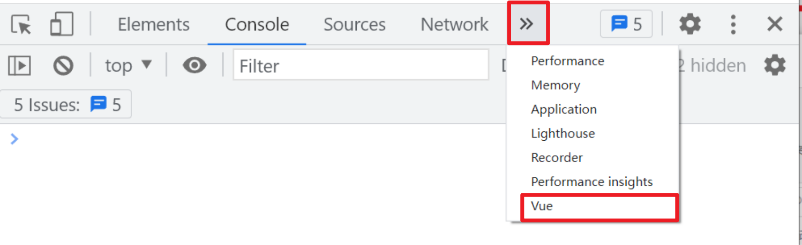

# Vue DAY03

#### `:key`的作用

`v-for`指令一般都需要配一个 `v-bind:key` `(:key)` 来为当前每一个列表项设置一个唯一标识符（简单理解为一个名字），目的是为了提高列表更新时的DOM渲染性能。

如果当前列表中已经包含很多列表项了，后续由于列表数据的变化需要重新渲染列表时，将会通过:key绑定的值来检测当前需要渲染的列表项是否原来已经渲染过（比较列表项的key在原始列表中是否已经存在），如果已经存在则不再重新创建DOM，仅需更新即可。

**一般将什么值设置为key？**

要求每个列表项必须唯一，数据类型要么number、要么用string。实在没有，可以用下标，但是用下标有坑。

```html
<div v-for="item,i  in  list"  :key="item.id">列表项</div>
<div v-for="item,i  in  list"  :key="i">列表项</div>
```

**案例：编写一个购物车**

1. 下载Cart.vue组件，配置路由，访问：/cart可以看到该购物车静态页面。


如果希望在末尾计算购物车所有商品总价格时，发现计算算法较为复杂，无法在页面中直接用`{{}}`来表示，所以可以如下实现：

```javascript
methods: {
    /** 获取购物车总价格，将每一件商品单价*数量，再累加即可 */
    getTotal() {
        let total = 0
        this.cartInfo.forEach(item=>{
            total += item.count * item.price
        })
        return total
    }
},
```

```html
<div style="width:300px; font-size:1.5em;">
    总计: ¥ {{ getTotal() }}
</div>
```

如上解决方案即可显示复杂运算的结果，并且当运算所需要的变量有变化时，页面也会及时更新。

Vue针对这一类需求（显示复杂运算的结果），也提供了一个更好的解决方案：**计算属性**。 


### Vue中的计算属性

Vue提供了一种特殊的属性：计算属性。它本质上就是一个函数，返回复杂运算之后的结果。在template中可以使用访问属性的语法来访问它。

定义计算属性：

```javascript
// computed选项用于定义计算属性，计算属性的本质实际上是函数
computed: {
    // 定义一个计算属性(函数)，函数名就是计算属性名
    totalPrice() {
        let total = 0
        this.cartInfo.forEach(item=>{
            total += item.count * item.price
        })
        return total
    }
},
```

```html
<div style="width:300px; font-size:1.5em;">
    总计: ¥ {{totalPrice}}
</div>
```

计算属性与方法本质上都是使用函数来定义，都需要进行运算之后才可以得到结果。不一样的是方法每次调用每次都要算，而计算属性第一次计算完毕后将会把结果进行缓存，后续需要使用时，直接拿来用。如果计算属性计算时涉及到的变量有变化，再重新运算。


### 表单元素的双向数据绑定指令 `v-model`

假如有如下输入框：

```html
<input type="text" placeholder="" v-model="username">
<button>提交</button>
```

```javascript
data(){
    return {
        username: ''
    }
}
```

如上写法即可完成输入框的value值与data中声明的username变量的**双向数据绑定**。

1. 如果用户在输入框中输入内容，则data中username的值会立即更新。
2. 如果通过程序修改了data中的username值，则将会立即更新界面。

案例：新建Form.vue，访问：/form时，看到该组件。该组件包含一个表单，收集用户数据。


**安装基于Chrome浏览器的vue扩展插件：**

```
Vue.jsDevtools-v5.3.3.crx
```

1. 打开浏览器的**扩展程序**界面：

   

2. 打开开发者模式，将插件拖拽进入chrome浏览器即可：

   

3. 找到控制台vue选项：

   


**案例：针对手机号码输入框，实现表单验证**

需求：只要在phone输入框中输入内容，那么就立即执行验证：

先判断输入的内容是否是11位字符串，如果是，则验证手机号码格式是否符合要求，如果不符合要求，则在后面提示红色的消息。


### Vue的监听器

Vue为了更好的监控所管理的变量的变化，提供了数据监听器：watch。通过监听器就可以监听数据（data中声明的变量）的动态更新。只要data中所管理的变量有变化，就会触发相应的监听器，执行监听方法：

```javascript
data(){
    return {
        name: ''
    }
}
watch: {
    name(newValue, oldValue){
        
    }
}
```


