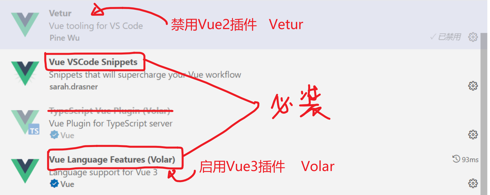

# TSOOP DAY03

### 面向对象编程 

```Javascript
SeatSelector.js

1. 通过canvas画大div套小div的基础结构。
2. 框选、点选小div时，将小座位设置为选中状态。蓝色。
3. 点击按钮，将选中的小座位变成普通座位。
4. 点击按钮，将选中的小座位变成过道。
5. 计算当前放映厅中所有的座位的数量。
6. 将放映厅的座位情况转换成json字符串，输出。
class Seat {
    x,
    y,
    width,
    type,
    selected
}

class  SeatSelector{
    canvas
    row
    col
    seats: Seat[];
    constructor(canvas, row, col){}
    }
    draw(){ 将完整的座位分布画出来 }
    setSelectedSeatToNormalSeat(){}
    toJson()
}
```


面向对象编程是一种新的编程方式，它是一种将一些零散变量与函数封装在一起统一解决问题的编程方式。

**类**  （面向对象编程思想中的**自定义类型**） 

```
class Person {
    name: string;
    age: number;
    gender: string;
    married: boolean;
}
```

**对象：**（通过类型的定义，创建出来的一个具体的实例）

```
let p1 = new Person('zs', 15, '男', false)
let p2 = new Person('ls', 25, '女', true)
new Date()
new Array()
new Option()
new AMap.Map(document.getElementById('contaniner'))
new AMap.Map()
```


案例：做一个扑克牌比大小的小游戏。

需求：两个人，一副牌（54张）。洗牌，起牌，每人27张。每人拿出一张比大小，大的得1分，否则不得分。最后比较谁赢了。

```
map = new AMap.Map()
map.setCenter()
map.setZoom()
map.add()
map.addControl()
map.xxx()


class Card {
    suit:number;
    rank:number;
}
new Card()  一张牌
```

```
class Player {
    name: string;
    score: number;
    cards: Card[];
}
new Player()
new Player()
```


### TS接口：interface

```javascript
// interface.ts  测试TS中的接口

/**
 * 参数契约：
 * 我定义的方法需要接收一个object，而且object里面得有page与pagesize
 */
function queryMovies(params: {page:number, pagesize:number}){
  // 通过接收params中的参数信息，从而发送axios请求
  console.log(params.page)
  console.log(params.pagesize)
}

queryMovies({page:1, pagesize:20})
// queryMovies({page:1, pagesize:20, name:'关键字'})
// queryMovies({currentPage:1, pagesize:20})


// 使用interface关键字声明接口，定义规范：参数契约
interface Movie {
  name: string,
  star_actor: string,
  showingon: string,
  duration?: number,  // 可选属性
}
// 要求传来的参数，必须符合Movie接口的契约规范  （属性名、属性类型）
function addMovie(params: Movie){
  // 既然知道了params是符合Movie接口规范的，则可以直接访问其属性
  console.log(params.name)
  console.log(params.star_actor)
}

addMovie({
  name:'杀手', 
  star_actor:'lion', 
  duration:121, 
  showingon:'2023-10-10'
})
addMovie({
  name:'杀手', 
  star_actor:'lion', 
  showingon:'2023-10-10'
})

// 定义一个接口的子类  让MyMovie类实现Movie接口
// 实现接口就意味着MyMovie类从语法上要满足Movie接口的所有参数契约
class MyMovie implements Movie {
  name: string;
  showingon: string;
  star_actor: string;
  constructor(name:string, showingon:string, star_actor:string){
    this.name = name;
    this.showingon = showingon;
    this.star_actor = star_actor;
  }
}
// 创建出来的对象，一定会满足MyMovie接口的参数契约，
let m = new MyMovie('名字', '2023年6月19日', '主演1,主演2')
// 所以将一个MyMovie对象传给addMovie方法是完全合理的。
addMovie(m)
```


## Vue 3.x

对比`vue2`， `vue3`针对程序员编程方式上的改动还是挺大的。借助于VueCLI脚手架可以方便的创建vue3项目。可以使用Javascript，也可以使用typescript作为编程语言。TS更适合大项目。

vue3+javascript

vue3+typescript

### Vue3的`VSCODE`插件



### 基于VueCLI创建新的脚手架项目 (Vue3.x + Typescript)

1. 找一个干净目录（`day03/demo/`），执行命令，新建项目： 

   ```shell
   vue  create  vue3-project
   # 依次选择
   Manually select features
   # 选择以下5项 （注意选中Typescript）
    (*) Babel
    (*) TypeScript
    (*) Router
    (*) Vuex
    (*) CSS Pre-processors
   # 选择3.x
   3.x
   # 一路回车
   ```

2. 使用命令，启动项目：

   ```
   cd  vue3-project
   npm  run  serve
   ```

3. 将项目拖拽到vscode，开发。

### 关于属性Data

1. vue2中使用data来定义页面中需要使用的变量。

   ```javascript
   data(){
       return {
           
       }
   }
   ```

2. vue3中使用setup方法来定义页面中需要使用的变量。

   ```javascript
   setup(){
       return {
           
       }
   }
   ```

3. 在vue2中，data中声明的变量将会自动具备响应式的特点。而在vue3中，数据响应式的功能完全交给了程序员自己来处理，哪些对象需要响应式，可以通过ref、reactive等方法创建代理对象来实现。普通的属性是不具备响应式的特点的。也由于此，vue3的UI渲染性能要高于vue2。


