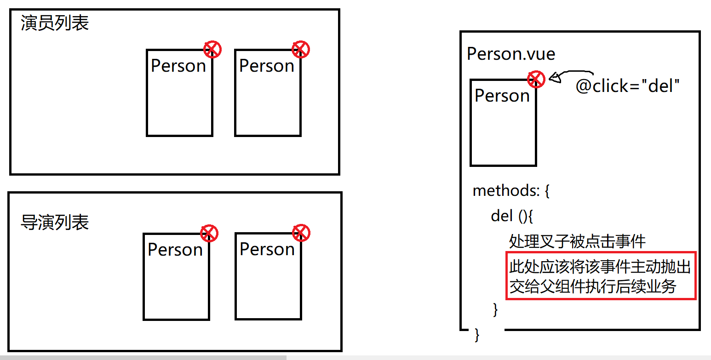

# Vue2Project DAY04

#### 在搜索框中敲回车，实现模糊查询的业务

```html
<el-input @keyup.native.enter=""></el-input>
```


### Vue的事件修饰符

在Vue中，为html标签绑定事件的方式：

```html
<button @click="doClick"></button>
```

Vue将会为button标签，绑定原生的鼠标单击事件，一旦触发该事件，则执行doClick()。但是如果为自定义组件绑定事件：

```html
<el-input @blur="" @focus="" @keyup=""></el-input>
```

Vue将会把这些事件当做是el-input组件底层抛出的自定义事件，不会当做是dom原生事件来进行绑定，所以，默认情况下焦点失去、获取、键盘抬起时不会触发这些事件。所以需要如下：

```html
<el-input @blur.native="" 
          @focus.native="" 
          @keyup.native=""></el-input>
```

`.native`属于vue提供的**事件修饰符**，写在事件类型的后面就可以生效，作用就是告诉vue，当前事件就是原生的dom事件，不要当做是组件的自定义事件，这样当焦点失去、获取、键盘抬起时就会触发，执行相应方法。

Vue认为，事件处理函数内部更多的代码应该聚焦在业务功能的实现上，而不是某些琐碎的事件对象处理上。所以vue提供了很多事件修饰符来帮助简化这些代码。

```html
<button @click.stop=""></button>   stop可以阻止事件冒泡
<a href="#" @click.prevent=""></a>  prevent可以阻止浏览器的默认行为（不跳转）
<button @click.once=""></button>  该事件仅触发一次
<input @keyup.enter="">
<input @keyup.page-down="">
<input @keyup.delete="">
```


#### 实现新增演员业务

**功能需求：**填写新增演员表单，选择一张图片作为头像，立即上传，得到头像路径，点击新增后，将名字与头像路径传给后端新增到数据库。

1. 准备好静态页面。表单。
2. 实现上传业务，上传成功后，需要整理好演员信息： {actorName:xxx,  actorAvatar:xxx}
3. 点击新增演员按钮，再次发送请求，将演员信息添加到数据库即可。


### 实现导演模块相关业务

1. 在HomeView.vue中为左侧边栏菜单添加一个子菜单：**导演管理** - 导演列表、新增导演。

2. 点击之后，分别显示`DirectorList.vue`   `DirectorAdd.vue`。需要编写组件并且配置嵌套路由。

3. 由于导演模块的这两个页面与演员模块的两个页面功能类似，复制粘贴改一下即可。

   Ctrl+F，查找替换：

   ```
   演员 > 导演
   actor  >  director
   Actor  >  Director
   ```


#### 实现演员与导演的删除



如上图发现对于Person组件，仅仅希望使用它封装的页面结构，但是不同的父组件点击了叉子之后所做的事情也是不同的，所以不能直接将删除的业务代码写在子组件里。此处适合使用Vue自定义组件的 **自定义事件**来实现。

子组件可以自发的抛出一个自定义事件，父组件可以捕获这个自定义事件并处理。

如何实现自定义事件？

**父组件：**

```html
<person name="" avatar="" @delPerson="doDel"></person>
<script>
	...
    methods: {
        doDel(){
            执行具体的删除业务即可
        }
    }
    ...
</script>
```

**子组件：**

```html
<template>
	<button @click="del">删除</button>
</template>
<script>
    ....
    methods: {
        del(){
            //此处主动抛出一个自定义事件，事件类型名完全自定义 
            this.$emit('delPerson')
        }
    }
    ...
</script>
```


#### 封装Axios

当前业务中使用Axios发送请求时的API的设计弊端：

1. 每次发请求，都需要写url路径，url路径前缀保持一致。当前项目中其实有两种前缀：

   ```
   测试环境
   http://localhost:3010/      业务模块请求前缀
   http://localhost:9000/      上传文件模块请求前缀
   
   生产环境
   https://web.codeboy.com/bmdapi/      	   业务模块请求前缀
   https://web.codeboy.com/bmduploadapi/      上传文件模块请求前缀
   ```

   现阶段写法如果要切换生产环境与测试环境接口时，非常麻烦。

2. 如果在项目中有多个地方都需要发送相同类型的请求（例如：通过关键字模糊查询演员列表），那么每次发请求时，都需要使用相应的url接口地址，代码中就需要每次都去接口文档看一眼（地址、参数列表）。更恶心的是如果领导修改了接口地址，所以使用该地址的地方都得该一遍，非常麻烦。


#### Axios的封装设计的实现流程

1. 解决如果在项目中有多个地方都需要发送相同类型的请求时，需要重复写相应的url接口地址与参数的问题。

   在src/http文件夹中新建：index.js，导出httpApi对象，在该对象中提供发送请求的接口方法。这样，谁想发请求，只需要引入该httpApi对象，调用方法即可。

   ```javascript
   import myaxios from "./MyAxios"
   
   const httpApi = {
   
     /** 查询首页演员列表 */
     queryActors(){
       let url = "http://localhost:3010/movie-actors"
       let params = {page:1, pagesize:100}
       return myaxios.get(url, params)
     }
   
   }
   
   export default httpApi
   ```

   当需要访问演员列表时，可以引入该js文件，调用httpApi的接口方法获取结果即可：

   ```javascript
   import httpApi from '@/http/index'
   
   /** 列出演员列表 */
   listActors() {
       httpApi.queryActors().then(res=>{
           this.actors = res.data.data
       })
   }
   ```

2. 当解决了上述问题后，又发现httpApi对象中需要定义所有的请求接口方法，导致httpApi对象臃肿不堪，方法繁杂，所有接口的访问方法都得在这一个对象里。需要进一步封装：按照业务模块将Api接口方法拆开，放在不同的js文件里。

   ```
   src/http/index.js
   src/http/apis/ActorApi.js
   src/http/apis/DirectorApi.js
   src/http/apis/MovieApi.js
   ...
   ```


