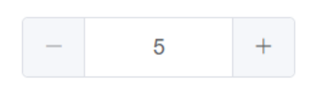
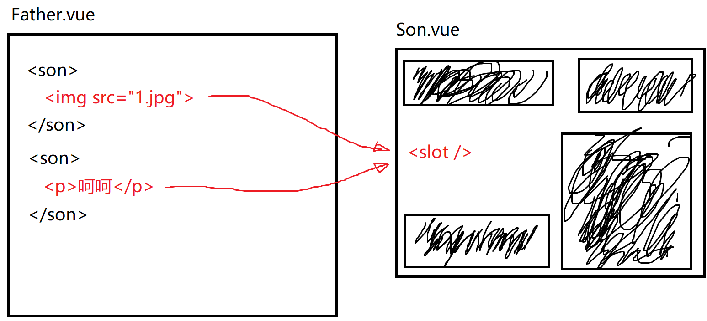
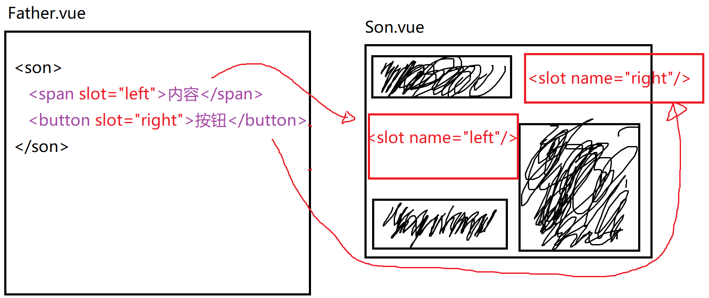
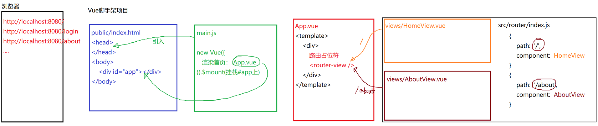
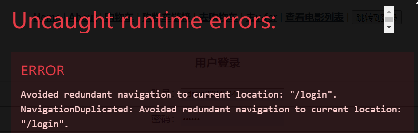

# Vue DAY05

#### Vue中的自定义组件

被Vue所管理的标签可以认为是vue的**组件**。在项目开发过程中经常会遇到一些需要**复用**的标签结构以及相应的样式、功能。vue提供了自定义组件的语法，可以让开发者将一些重复使用的页面结构、样式、功能组织一起，作为一个整体（新的组件）存在在项目中。这样如果需要使用这个组件时，直接引用即可使用自定义标签来显示。

```html
<person avatar="http:头像路径" name="人名"></person>
```


**如何设计并实现一个自定义组件？**

1. 新建自定义组件文件：`src/components/Person.vue`。

2. 在该文件中编写`template`、`script`、`style`代码。 

3. 当需要使用这个组件时，需要引入该组件，使用自定义标签来引用它，显示它。

   ```html
   <person></person>
   <abc></abc>
   <PersonInfo></PersonInfo>
   <person-info></person-info>
   ```

   ```javascript
   import Person from '@/components/Person.vue'
   export default {
       // components用于声明当前组件需要引用的子组件
       components: {
           // 属性名就是自定义标签名 :   属性值引用了Person对象
           Person: Person,
           abc: Person,
           PersonInfo: Person
       }
   }
   ```


#### 父组件向子组件传递自定义参数

```html
<person avatar="头像路径" name="人名"></person>
<person :avatar="头像路径" :name="人名"></person>
<person :data="{avatar:'1.jpg', name='张三'}"></person>
```

若子组件需要接收父组件传来的参数（为了动态显示组件内容），则需要在子组件中事先声明自定义属性，通过自定义属性来接收父组件传来的数据，从而实现相应的功能。

1. 在子组件中设计一些自定义属性：

   ```javascript
   export default { 
       // props选项用于定义当前组件的自定义属性 avatar name
       // 一旦定义了这些属性，则在使用当前组件时，就可以传参
       // <person avatar="a.jpg" name='张三' ></person>
       // <person avatar="b.jpg" name='李四' ></person>
       // <person avatar="c.jpg" name='王五' ></person>
       // <person avatar="d.jpg" name='赵六' ></person>
       props: ['avatar', 'name']
   }
   ```

2. 在使用子组件时，就可以给这些属性赋值（通过标签属性赋值的语法）：

   ```html
   <person avatar="头像路径" name="人名"></person>
   <person :avatar="变量a" :name="变量b"></person>
   ```


在组件声明自定义属性时，可以用一种相对详细的语法定义属性的细节：

```javascript
export default { 
    props: {
        name: {
            type: string,    // 指定属性的数据类型  
            default: '姓名'   // 没有指定name时的默认值
        },
        avatar: {
            type: string,
            required: true   // 要求该属性必填
        }
    }
}
```


案例：设计一个计数器组件，可以实现如下功能：



```html
<counter></counter>
<counter :value="25"></counter>
<counter :min="1" :max="10"></counter>
<counter :min="1" :max="10" :step="2"></counter>
```

1. 通过counter标签即可看到该组件。
2. 通过value属性，设置计数器的初始值。
3. 通过min定义最小值，通过max属性定义最大值。
4. 如果已经是最小值，则不能再减；同理，如果已经是最大值，则不能再加了。


#### 组件插槽（slot）

平时在设计子组件时，绝大多数的布局都已经在子组件中完成定义，但是有些布局需要在父组件使用子组件时动态设置，这时就可以使用**组件插槽**来实现。 在设计子组件时，可以在布局中定义一个插槽位置并给与基础样式，父组件在使用时，就可以动态设置需要显示的内容。

##### 默认插槽：



**实现步骤：**

1. 在子组件中的某一个位置，通过`<slot />`来指定插槽的位置。定义通用的基础布局样式。

   ```html
   <template>
     <div class="counter">
       <!-- 设计一个默认插槽位置 -->
       <slot />
       <span>{{n}}</span>
     </div>
   </template>
   ```

2. 在父组件使用子组件时，可以在组件标签内容部分设置插槽的具体内容：

   ```html
   <counter>
       
   </counter>
   <counter>
       <p>插槽内容</p>
   </counter>
   ```


##### 具名插槽（带有名字的插槽）

如果一个子组件中有多个地方都需要父组件动态设置，则可以使用**具名插槽**来实现。顾名思义，可以给每一个插槽设置一个名字，父组件在动态设置时就可以指定不同的插槽位置进行内容设置。



**实现步骤：**

1. 在子组件中定义插槽（通过`<slot name=''>`标签），并且为每一个插槽设置一个name属性：

   ```html
   <template>
     <div class="counter">
       <span>
         <slot name="label"/>
         {{n}}
         <slot name="unit"/>
       </span>
     </div>
   </template>
   ```

2. 当使用该子组件时，就可以通过为标签设置slot属性，来明确到底放到子组件的哪一个插槽中：

   ```html
   <counter>
       <b slot="label">墨水:</b>
       <b slot="unit">瓶</b>
   </counter>
   <counter>
       <b slot="label">练习题:</b>
       <b slot="unit">套</b>
   </counter>
   ```


### VueCLI脚手架中的路由系统   VueRouter

多页面项目的开发。一个大型项目需要多个页面组成，页面之间也可以进行跳转。

开发方式有两种：

1. 传统方案： 每一个页面都是一个独立的html文件，通过超链接a标签进行跳转。

   当页面跳转时，需要浏览器重新加载新的html文档。

2. 单页面应用方案：一个项目中只有一个html文件，通过js，根据不同的路径动态加载页面内容，更新html的局部。

   当页面跳转时，仅仅只是当前html中的一个div的内容的替换，不会刷新页面。


VueRouter插件将页面跳转的过程全权代理。路由地址变化时完全被Vuerouter所拦截，由VueRouter来决定如何显示页面。

VueRouter的项目属于单页面应用（Single Page Application）（SPA）。意味着VueCLI项目无论设计多少个页面，本质上都是只有一个html。



配置路由时有两种配置方式：

1. 标准模式

   ```javascript
   import HomeView from '../views/HomeView.vue'
   import Cart from '../views/Cart.vue'
   import AboutView from '../views/AboutView.vue'
   import For from '../views/For.vue'
   const routes = [
       {
           path: '/',
           name: 'home',
           component: HomeView
       }
   ]
   ```

   对于标准模式加载的组件，在import的时候就已经将组件加载到了内存中，这样的话，当vue项目初始化时，随着路由系统的加载将直接引入该组件（虽然可能没有立即看到该组件，但是已经下载完毕，在内存中已经存在）。

2. 懒加载模式

   ```javascript
   const routes = [
     {
       path: '/about',
       name: 'about',
       component: () => import('../views/AboutView.vue')
     },
   ]
   ```

   懒加载模式不会在项目启动是就去加载相关组件，这种引入方式将会在需要使用该组件时再加载相应资源。真正做到随用随下载。这种模式将会极大的释放项目首页资源数据量的压力，防止出现首页白屏等待。

   **结论：**

   除了Home之外，一般都使用懒加载即可。


#### 基于路由系统完成页面的跳转功能

##### 组件式跳转

通过`<router-link>`组件实现路由的跳转：

```html
<router-link to="目标路径">链接文本</router-link>
<router-link to="/">链接文本</router-link>

<router-link :to="{path:'/cart'}">去购物车</router-link>
<router-link :to="{name:'for'}">去v-for</router-link>
```

##### 编程式跳转

```javascript
methods: {
    doClick(){
        this.$router.push('/movie-list')
        this.$router.replace('/movie-list')
    }
}
```

##### this.$router

在vue组件中使用`this.$router`可以获取全局唯一的路由管理器对象。该路由管理器对象在`router/index.js`中暴露出来的对象。该路由管理器对象中包含了所有已经配置好的路由对象，还有历史记录等信息。

`this.$router`提供了一些方法用于管理路由：

```javascript
this.$router.push('/actors')
this.$router.push({'path': '/actors'})
this.$router.push({'name': 'actors'})

this.$router.replace('/actors')
this.$router.go(-1)
```

在编程式路由跳转时，有可能出现下列错误：



如果当前已经在/login了，还要跳转到/login，重复跳转，就会报上述错误。尽量通过程序避免重复跳转。


案例：从电影列表页，跳转到电影详情页。在跳转的过程中，需要将选中的电影的ID一起带给详情页，这样才可以在详情页中通过该id发送请求，拿到详细信息后显示。


#### 路由跳转过程中的参数传递问题

路由传参的方案大致分为两种：

1. **第一种参数传递的方案：在路径后使用?拼接参数**

   假设需要从`/movie-list`跳转到`/movie-detail`，并且传递参数，则可以如下跳转：

   ```html
   <router-link to="/movie-detail?id=600">详情</router-link>
   <router-link :to="{path:'/movie-detail', query:{id:600}}">
       详情
   </router-link>
   ```

   如上述方式即可将参数直接带到目标页面，在目标页面中使用如下代码即可获取参数id:

   ```javascript
   let id = this.$route.query.id
   ```

2. **第二种参数传递的方案：将参数藏在路径里，通过params方式传参** 

   ```html
   <router-link to="/movie-detail/600">详情</router-link>
   <router-link to="/movie-detail/554">详情</router-link>
   ```

   需要修改一下电影详情页的路由配置：

   ```javascript
   {
       path: '/movie-detail/:movieId',
       name: 'movie-detail',
       component: () => import('../views/MovieDetail.vue'),
   },
   ```

   如上述方式即可将参数带到目标页面，在目标页面中使用如下代码即可获取参数id:

   ```javascript
   let id = this.$route.params.movieId
   ```


`this.$route`

在vue组件中，可以通过`this.$route`来访问当前组件的路由对象（相当于`router/index.js`中定义的一个路由配置：`{path:'', component:组件}`）。

$router：路由管理器。管理所有路由对象

$route:  路由对象。仅仅描述其中一个路由信息


### Vue组件的生命周期

整个vue项目就是由一个一个组件组成，每个组件各司其职。当需要看到某一个组件时，vue框架就会创建该组件对象，将组件的内容挂载到页面上显示。当需要跳转页面时，vue将会从dom中卸载旧组件，销毁它，然后创建新组件，将新组建挂载到页面中显示。整个过程都是由vue管理的。

所以，如果有以下需求，该怎么做？

```
当组件对象创建成功后，发送一个请求，加载详情...
当组件对象挂载到页面中显示后，加载高德地图的AMap，在某一个div中初始化地图....
当组件的内容有变化时，获取这些变化，处理相关业务...
当组件即将卸载时（需要跳转到另一个页面），应该释放高德地图所占用的资源等....
......
......
......
......
```

vue组件的生命周期就是为了解决这些问题。当遇到这些业务需求时，vue提供了编写相关业务代码的“**生命周期钩子方法**”，**这些方法将会在组件使用过程中的相应时间点自动被调用，如果我们有一些业务需求，可以选择在相应的生命周期方法中来进行编写。**

Vue提供的常见的生命周期方法：

```javascript
export default {
    beforeCreate(){},
    created(){},
    beforeMount(){},
	mounted(){},
    beforeUpdate(){},
    updated(){},
    beforeDestroy(){},
    destroyed(){}
}
```


